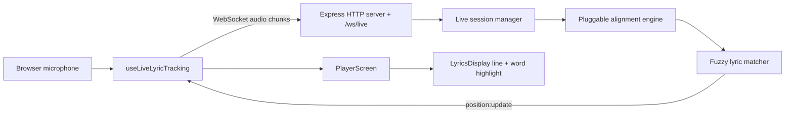

# Live AI Follow Architecture

## Protocol

Client JSON control messages: `session:start`, `audio:chunk`, `session:pause`, `session:resume`, `session:reset`, and `session:end`. The first implementation sends base64 `audio:chunk` payloads from `MediaRecorder`; this is easier to inspect and proxy than binary frames, but it is larger on the wire. The server also accepts binary audio frames for future adapters.

Server messages: `session:ready`, `position:update`, `confidence:update`, `engine:status`, `session:error`, and `session:ended`.

## Backend flow

The WebSocket server is attached beside the existing REST API. A live session preprocesses lyrics into normalized text, line records, word tokens, token-to-line mappings, and searchable windows. The mock adapter uses transcript fragments when available and the same adapter interface can be replaced with Faster-Whisper, whisper.cpp, or a Python service configured through environment variables.

## Database changes

No existing song field is required to change. Optional future fields can include `language`, `liveFollowDefaults`, and cached normalized lyric metadata. A `LiveSession` collection can be added later for user analytics such as average confidence, maximum latency, and skipped/repeated sections.

## Local development

1. Start MongoDB.
2. Configure `backend/.env` from `backend/.env.example`.
3. Configure `frontend/.env.local` from `frontend/.env.example`.
4. Run the backend and frontend as usual.
5. Use the player settings panel to switch from timed audio to Live AI Follow.

## Production notes

Browser microphone access requires HTTPS, except on localhost. Deploy the alignment engine as a local process, Python microservice, Docker service, GPU server, or CPU fallback. Keep `LIVE_ALIGNMENT_SERVICE_URL` and model paths in environment variables; do not hardcode keys or model locations.

## Performance and limitations

The mock adapter validates the WebSocket and UI flow but does not transcribe real vocals. Production adapters should emit transcript fragments several times per second and target perceived latency under 500ms. Matching prefers nearby lyric lines, expands search during low confidence, and allows strong forward or backward jumps for skips and repeated lyrics.
